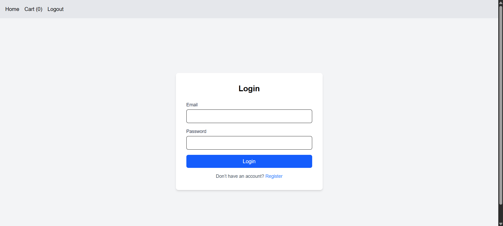
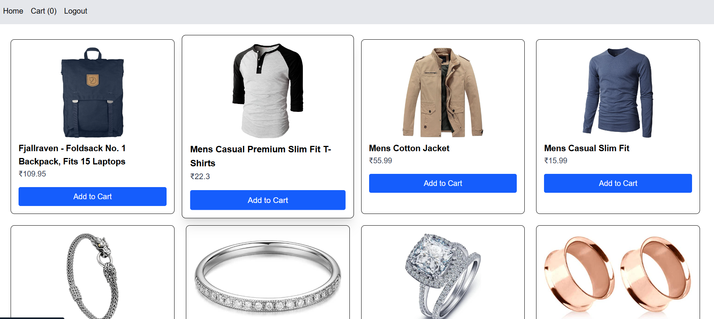
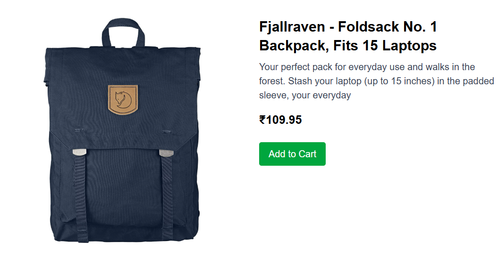
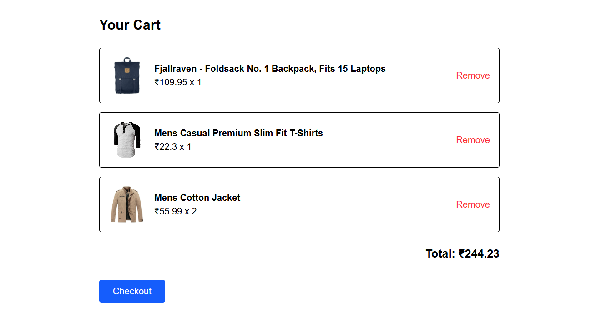
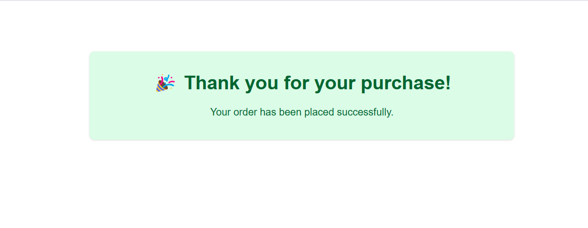

# 🛒 React Shopping Website

A fully functional shopping website built using **React** and the **Fake Store API**. It includes user authentication, product listing, product details, cart management, and a simple checkout flow with thank-you confirmation.

## 🚀 Features

- ✅ User Registration & Login (JWT-based)
- 🛍️ Product Listing from Fake Store API
- 📦 Product Detail View
- 🛒 Add to Cart / Remove from Cart
- 💵 Total Calculation in Cart
- ✅ Checkout with Thank You Message
- 🔐 Private Routes for Authenticated Users
- 🎨 Responsive Design using Tailwind CSS
- 🔁 Persistent cart state using React Context API

## 📸 Screenshots

### Login Page

### 🖥️ Home Page

### 🛒 Product Detail Page

### 🧾 Cart Page

### ✅ Checkout Confirmation

## 🧑‍💻 Tech Stack

- **Frontend:** React, React Router
- **Authentication:** JWT (stored in `localStorage`)
- **Styling:** Tailwind CSS
- **State Management:** React Context API
- **API:** [Fake Store API](https://fakestoreapi.com/)

## 📦 Installation

cd react-shopping-website
npm install
npm run dev

## 🔐 Authentication
- User credentials are stored securely.

- JWT is saved in **localStorage** on login and validated on each route.

## 🧪 Test Credentials
To test the app:

- Register with any email/password

- Or login if already registered

## 💡 Future Improvements
- Payment gateway integration

- Order history page

- Search & filtering

- Product reviews

## 🙌 Acknowledgements
- Fake Store API

- React Community

- Tailwind CSS